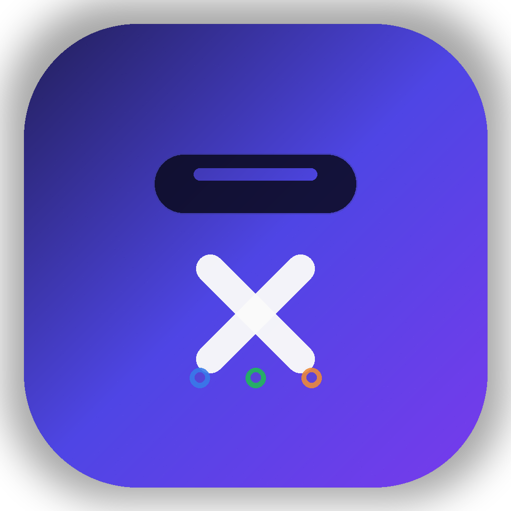

[中文](README_zh.md) | English

<p align="center">
  
</p>

<h1 align="center">X Island</h1>

<p align="center">
  A macOS Dynamic Island-style control tower for all your AI coding agents.<br>
  Monitor Claude Code, Cursor, Codex, OpenCode, Gemini CLI and more — from a single floating panel.
</p>

## Demo

<p align="center">
  
</p>

| Collapsed (Notch) | Collapsed (External) | Expanded | Question |
|:---------:|:---------:|:--------:|:--------:|
|  |  |  |  |

## What It Does

X Island sits at the top of your screen as a compact pill. When your AI agents are working, it shows their status at a glance. Hover to expand and see all active sessions with full details.

**Core features:**

- **Unified dashboard** — See all AI coding agents in one place, regardless of which terminal or IDE they run in
- **Real-time status** — Live status dots (blue = working, green = done, orange = needs input, red = error)
- **Permission approval** — Approve or deny file/command permissions directly from the island, no need to switch windows
- **Question answering** — Answer agent questions from the island UI
- **Plan review** — Review and approve agent plans inline
- **Smart notifications** — 8-bit sound effects for session events (configurable per event)
- **Multi-session support** — Multiple conversations per agent, each tracked independently
- **Window jumping** — Click a session to jump to the exact terminal tab or IDE window (iTerm2 tab-level precision)
- **Horizontal dragging** — Drag the island left/right along the top edge
- **Session titles** — Shows first user prompt as title, workspace folder as subtitle
- **Multi-language** — Supports English, Chinese, Korean, Japanese, French
- **Quota tracking** — Check remaining balance for Kimi, DeepSeek, GLM APIs
- **External monitor support** — Island automatically follows mouse between displays
- **Streaming thought display** — Real-time animated thinking indicator during agent reasoning
- **Activity log** — Chronological feed of all tool calls across all sessions
- **Tool event details** — Test result parsing and lines-read statistics per tool call
- **SSH Remote Manager** — Connect and monitor remote servers directly from the island

**Supported agents:**

| Agent | Hook System | Status |
|-------|------------|--------|
| Claude Code | Native hooks (settings.json) | Full support |
| Cursor | Hooks API (hooks.json) | Full support |
| Codex (OpenAI) | Native hooks | Full support |
| OpenCode | JS plugin | Full support |
| GLM (Zhipu) | TOML hooks (config.toml) | Full support |
| Kimi (Moonshot) | TOML hooks (config.toml) | Full support |
| DeepSeek | TOML hooks (config.toml) | Full support |
| Gemini CLI | Config hook | Basic support |
| Copilot (VS Code) | Config hook | Basic support |

## Install

### Option 1: Download DMG (Recommended)

1. Go to [Releases](https://github.com/Meteorkid/XIsland/releases) and download the latest `.dmg` file
2. Open the DMG and drag **X Island** to your Applications folder
3. Launch X Island

> **macOS Gatekeeper notice:** Since the app is not signed with an Apple Developer certificate, macOS will block it on first launch. To bypass:
>
> ```bash
> xattr -cr /Applications/X\ Island.app
> ```
>
> Or: **System Settings → Privacy & Security → scroll down → click "Open Anyway"** next to the X Island warning.

### CLI Upgrade

X Island installs a companion CLI at `~/.xisland/bin/xisland`.

If that directory is in your `PATH`, you can upgrade directly from GitHub Releases with:

```bash
xisland upgrade
```

Requirements:
- `gh` must be installed and authenticated
- X Island must already be installed in `/Applications/X Island.app`

If `xisland` is not found, add this to your shell profile:

```bash
export PATH="$HOME/.xisland/bin:$PATH"
```

`bash Scripts/build.sh` will also print the right profile file for your current shell after installing the CLI.

### Option 2: Build from Source

**Prerequisites:** macOS 14.0+, Swift 5.9+

```bash
git clone https://github.com/Meteorkid/XIsland.git
cd xisland
bash Scripts/build.sh
open ".build/X Island.app"
```

### Agent Configuration

X Island **auto-configures** hooks for all detected agents on first launch. No manual setup needed.

To verify or manually trigger configuration:
- Open X Island Settings (gear icon or menu bar)
- Go to the **Agents** tab
- Toggle agents on/off as needed

Under the hood, it installs a lightweight bridge binary (`di-bridge`) at `~/.xisland/bin/` and registers hooks in each agent's config file.
The same directory also contains the `xisland` CLI used for in-place upgrades.

## Architecture

```
┌─────────────────────────────────────────────────┐
│                  X Island App                    │
│                                                  │
│   NotchWindow (NSPanel)                          │
│   ├── CollapsedPillView (status dots)            │
│   └── Expanded View                              │
│       ├── SessionListView (session cards)        │
│       ├── PermissionApprovalView                 │
│       ├── QuestionAnswerView                     │
│       └── PlanReviewView                         │
│                                                  │
│   SessionManager ← Unix Socket ← di-bridge      │
│   AudioEngine (8-bit sound synthesis)            │
│   ZeroConfigManager (auto-configures agents)     │
└─────────────────────────────────────────────────┘

Agent hooks fire → di-bridge encodes message → socket → SessionManager
```

**Key components:**

- **`XIsland`** — Main app. SwiftUI views hosted in an `NSPanel` for the floating island UI
- **`DIBridge`** — Lightweight CLI binary invoked by agent hooks. Reads stdin JSON, encodes it as a `DIMessage`, sends via Unix socket
- **`DIShared`** — Shared protocol definitions (`DIMessage`, socket config)

## Project Structure

```
Sources/
├── DIShared/          # Shared protocol & socket config
│   └── Protocol.swift
├── DIBridge/          # Bridge CLI binary
│   └── DIBridge.swift
└── DynamicIsland/     # Main app
    ├── XIslandApp.swift
    ├── AppDelegate.swift
    ├── NotchWindow.swift
    ├── Models/
    │   ├── AgentSession.swift
    │   ├── AgentType.swift
    │   ├── ToolEvent.swift
    │   └── QuotaInfo.swift
    ├── Managers/
    │   ├── SessionManager.swift
    │   ├── AudioEngine.swift
    │   ├── SocketServer.swift
    │   ├── ZeroConfigManager.swift
    │   ├── TerminalJumpManager.swift
    │   ├── UpdateManager.swift
    │   ├── AppUpdater.swift
    │   ├── L10n.swift
    │   ├── QuotaTracker.swift
    │   └── SSHRemoteManager.swift
    └── Views/
        ├── NotchContentView.swift
        ├── CollapsedPillView.swift
        ├── SessionListView.swift
        ├── ExpandedSessionView.swift
        ├── AgentActivityView.swift
        ├── PermissionApprovalView.swift
        ├── QuestionAnswerView.swift
        ├── PlanReviewView.swift
        └── PreferencesView.swift

Sources/XIslandUITestDriver/    # UI test driver & scenario runner
Tests/
├── TowerIslandTests/            # 125 Swift XCTest tests
├── Fixtures/                    # Test fixture data
└── TestUtilities/               # Shared test helpers

Scripts/
├── build.sh           # Release build + .app bundle
├── test-all.sh        # Full test suite (Swift + CLI)
├── test.sh            # Integration test suite
├── package-dmg.sh     # DMG packaging
└── xisland            # CLI helper script
```

## Testing

The project includes both Swift XCTest and bash integration test suites:

```bash
# Swift tests (125 tests, no running app required)
swift test

# Full bash integration test suite (requires app running)
bash Scripts/test-all.sh

# Run specific modules
bash Scripts/test.sh M1 M15 M17
```

Enforce this workflow locally with git hooks:

```bash
bash Scripts/install-git-hooks.sh
```

After installation, every `git commit` will run `bash Scripts/test-all.sh` automatically.

Test modules cover: message encoding, session lifecycle, agent identity, permission/question/plan flows, multi-session support, completion sound dedup, configurable linger, and more.

## Configuration

All settings are accessible from the X Island Settings panel:

| Setting | Default | Description |
|---------|---------|-------------|
| Auto-collapse delay | 3s | How long the panel stays open after interaction |
| Completed session display | 2 min | How long completed sessions remain visible (10s–5min or Never) |
| Smart suppression | On | Don't auto-expand when agent terminal is focused |
| Sound effects | Per-event | Toggle individual sound events on/off |

## How It Works

1. **Zero-config setup**: On launch, X Island scans for installed agents and injects lightweight hooks into their config files
2. **Hook → Bridge → Socket**: When an agent event fires (tool use, permission request, completion), the hook invokes `di-bridge` which sends a structured message over a Unix socket
3. **Real-time UI**: The main app receives messages via `SocketServer`, updates `SessionManager`, and the SwiftUI views react immediately
4. **Interactive responses**: For permissions and questions, the bridge process stays alive waiting for the user's response, then writes it back to stdout for the agent to consume

## License

MIT
